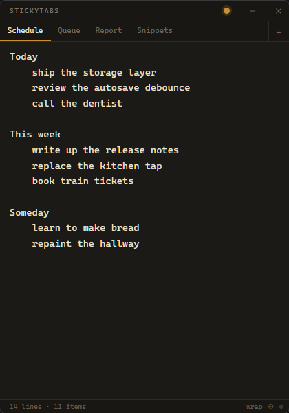

<div align="center">

# StickyTabs

**A multi-tab sticky note for Windows. Every tab is a plain `.txt` file you can open in Notepad.**



</div>

---

No database. No cloud. No accounts. No telemetry. No markdown rendering, no rich text,
no tags, no due dates. A small always-on-top window with tabs, and one big textarea.

The point is the storage format: **your notes are just text files in one folder.** Open
them in Notepad, edit them in Vim, grep them, sync them with whatever you already use,
back them up by copying a directory. If StickyTabs disappeared tomorrow your notes would
be exactly as readable as they are today.

## Get it running

Windows 10/11 x64. WebView2 is required and ships with Windows 11; on Windows 10 the
installer pulls it in if it is missing.

### Build it yourself

The reliable path, and the only one that works the moment you clone. You need
[Node](https://nodejs.org) 18+, [Rust](https://rustup.rs), and the MSVC build tools
(Visual Studio Build Tools with **Desktop development with C++**).

```bash
npm install
npm run tauri build
```

That produces two installers in `src-tauri/target/release/bundle/`:

- `nsis/StickyTabs_1.0.0_x64-setup.exe` — per-user install, no admin prompt. Use this one.
- `msi/StickyTabs_1.0.0_x64_en-US.msi` — for `msiexec` / Group Policy deployment.

To just run it without installing anything:

```bash
npm install
npm run tauri dev
```

### Prebuilt installers

Attached to [Releases](../../releases), when a version has been tagged. If that page is
empty, build from source above — it takes about five minutes, most of it Rust compiling.

Builds are unsigned either way, so SmartScreen shows *"Windows protected your PC"* on
first run — click **More info → Run anyway**. Uninstall from Settings → Apps.

## Where the window goes

Closing the window **hides it to the system tray** — the app keeps running so the global
hotkey still works. To bring it back, any of:

- press <kbd>Ctrl</kbd>+<kbd>Shift</kbd>+<kbd>N</kbd>
- click the tray icon — on Windows 11 new tray icons start in the overflow flyout behind
  the `^` chevron; drag it onto the taskbar to keep it visible
- launch StickyTabs again; the running copy comes to the front

**Quit** from the tray icon's right-click menu. That is the only way to fully exit.

## Your data

Everything lives in one folder, `%APPDATA%\StickyTabs\`:

```
tabs.json           tab order, display names, last active tab — nothing else
settings.json       theme, font size, wrap, always-on-top, Report tab, caret positions
notes\
  schedule.txt      the raw text of the Schedule tab. No wrapper, no metadata, no BOM.
  queue.txt
  report.txt
  snippets.txt
  _trash\           closed tabs. Nothing is ever deleted.
```

A `.txt` file **is** the note — there is no envelope format, no front-matter, no JSON
wrapper. Which means:

- Edit a note in any editor, restart, and it loads.
- Drop a `.txt` into `notes\` and it becomes a tab.
- Delete `tabs.json` and it is silently rebuilt by scanning the folder. No "restore?"
  dialog, because there is no decision to make — the text files are the truth.
- Close a tab and the file moves to `_trash\` rather than being deleted.

### Durability

Power loss is assumed, not feared. Every write goes to a temp file in the same directory,
is `fsync`ed, and is then renamed over the target — so a note is always either its old
contents or its new contents, never a truncated mix. The rename is retried, because
Windows Defender and the Search indexer transiently lock freshly created files and would
otherwise make autosave drop writes at random.

Autosave fires 400 ms after the last keystroke, and is forced on tab switch, window blur,
window close, and quit.

## Keys

| | |
|---|---|
| <kbd>Ctrl</kbd>+<kbd>Enter</kbd> | move the current line (or selection) to the **Report** tab, filed under today's `## YYYY-MM-DD` |
| <kbd>Ctrl</kbd>+<kbd>T</kbd> | new tab |
| <kbd>Ctrl</kbd>+<kbd>W</kbd> | close tab — confirms if it has text, file goes to `_trash\` |
| <kbd>Ctrl</kbd>+<kbd>Tab</kbd> / <kbd>Ctrl</kbd>+<kbd>Shift</kbd>+<kbd>Tab</kbd> | cycle tabs |
| <kbd>Ctrl</kbd>+<kbd>1</kbd>…<kbd>9</kbd> | jump to tab by position |
| <kbd>Ctrl</kbd>+<kbd>F</kbd> | find — <kbd>Enter</kbd>/<kbd>Shift</kbd>+<kbd>Enter</kbd> to step, <kbd>Esc</kbd> to close |
| <kbd>Ctrl</kbd>+<kbd>=</kbd> / <kbd>Ctrl</kbd>+<kbd>-</kbd> | font size |
| <kbd>Ctrl</kbd>+<kbd>Z</kbd> / <kbd>Ctrl</kbd>+<kbd>Y</kbd> | undo / redo, per tab, surviving tab switches |
| <kbd>Ctrl</kbd>+<kbd>S</kbd> | force a save (it already autosaves) |
| <kbd>Ctrl</kbd>+<kbd>Shift</kbd>+<kbd>N</kbd> | show/hide from anywhere |

Double-click a tab label to rename it — the `.txt` is renamed too, so the folder stays
readable. Drag a tab along the strip to reorder. Middle-click to close. Right-click the
editor or a tab for the menus.

## The Report tab

<kbd>Ctrl</kbd>+<kbd>Enter</kbd> takes the line the caret is on — or the whole selection —
removes it from the current tab, and appends it to the tab named **Report** under a
heading for today:

```
## 2026-08-16
ship the storage layer
review the autosave debounce

## 2026-08-15
fixed the atomic write retry
```

Newest date group at the top. The heading is created if today's does not exist yet, and
reused if it does. A toast offers **Undo** for 1.5 s, which puts both documents back
exactly as they were. Which tab counts as the Report tab is configurable in settings.

## Development

Run the checks:

```bash
npm run typecheck && npm run lint && npm test && cargo test --manifest-path src-tauri/Cargo.toml
```

### Layout

```
src/
  storage/      the Rust IPC boundary, typed; 400 ms debounced autosave with forced flush
  store/        zustand store, and a hand-rolled per-tab undo stack
  lib/          pure logic: Report insertion, find matching, the keyboard dispatcher
  components/   titlebar, tab strip, editor, find bar, status bar, settings modal
src-tauri/src/
  storage.rs    atomic writes, silent recovery, first-run seeding — the load-bearing file
  slug.rs       filename sanitising, including Windows reserved device names
  lib.rs        tray, global hotkey, single instance, close-to-tray
```

Tests: 65 frontend (`vitest`) and 23 Rust, covering the durability guarantees directly —
corrupt and missing `tabs.json` both rebuilding from the folder, orphan `.txt` adoption,
BOM/CRLF round-trips, atomic replacement, and path-traversal refusal.

`STICKYTABS_DATA_DIR` overrides the data directory, which is how the tests get a
throwaway folder — and it doubles as a portable-install escape hatch.

## Built with

[Tauri v2](https://tauri.app) · React · TypeScript · Rust

## License

MIT
